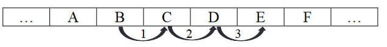
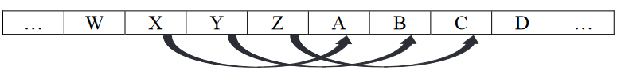

# Szyfr Cezara
Podstawieniowy szyfr Cezara z przesunięciem (kluczem) k polega na zastąpieniu każdego znaku jawnego znakiem leżącym w alfabecie o k pozycji w prawo od zastępowanego znaku. Przykład: znak ‘B’ po zakodowaniu kluczem k=3 zastąpiony zostanie znakiem ‘E’.

  

Przy szyfrowaniu znaku należy postępować w sposób cykliczny, to znaczy, jeżeli znak nie posiada w alfabecie następnika przesuniętego o k pozycji, to alfabet „zawija się" i za literą Z następuje znów litera A. Przykład: jawny znak ‘X’ po zakodowaniu kluczem k=3 zastąpiony zostanie znakiem ‘A’, znak ‘Y’ – znakiem ‘B’, natomiast ‘Z’ – znakiem ‘C’.

  

W tym zadaniu rozpatrujemy tylko słowa zbudowane z wielkich liter alfabetu angielskiego (o kodach ASCII odpowiednio od 65 do 90), o długościach nie większych niż 30 znaków.

---


Pliki tekstowe znajdują się w katalogu assets:
- [dane_1.txt](https://gitlab.com/ar_sci/programowanie_zaawansowanych_aplikacji_webowych_2022_2023_4c/-/blob/main/_exams/assets/exam_00_dane_1.txt)
- [dane_2.txt](https://gitlab.com/ar_sci/programowanie_zaawansowanych_aplikacji_webowych_2022_2023_4c/-/blob/main/_exams/assets/exam_00_dane_2.txt)
- [dane_3.txt](https://gitlab.com/ar_sci/programowanie_zaawansowanych_aplikacji_webowych_2022_2023_4c/-/blob/main/_exams/assets/exam_00_dane_3.txt)

---

## Zadanie_0
W pliku dane_1.txt znajduje się 100 słów. Słowa umieszczono w osobnych wierszach.

Fragment pliku dane_1.txt:
- INTERPRETOWANIE
- ROZWESELANIE
- KONSERWOWANIE

Napisz program, który zaszyfruje słowa z pliku dane_1.txt z użyciem klucza k = 107. Wynik zapisz do pliku wyniki_1.txt, każde słowo w osobnym wierszu, w porządku odpowiadającym kolejności słów z pliku z danymi.

Popowiedź:
```
Dla pierwszego słowa z pliku dane_1.txt (INTERPRETOWANIE) wynikiem jest słowo (LQWHUSUHWRZDQLH).
```

## Zadanie_1
W pliku dane_2.txt zapisano 3 000 szyfrogramów i odpowiadające im klucze szyfrujące. W każdym wierszu znajduje się jeden szyfrogram (zaszyfrowane słowo) i po pojedynczym znaku odstępu odpowiadający mu klucz (maksymalnie czterocyfrowa liczba).

Fragment pliku dane_2.txt:
- BCYKUNCM 1718
- YFOGNSKGYW 7580
- WARDA 9334

Napisz program, który odszyfruje słowa zaszyfrowane podanymi kluczami. Wynik zapisz w pliku wyniki_2.txt: każde odszyfrowane słowo w osobnym wierszu, w porządku odpowiadającym kolejności szyfrogramów z pliku z danymi.

Popowiedź:
```
Dla pierwszego szyfrogramu z pliku dane_2.txt (BCYKUNCM) wynikiem jest słowo
(ZAWISLAK).
```

## Zadanie_2 
W pliku dane_3.txt zapisano 3 000 par słów, po jednej parze w wierszu, oddzielonych pojedynczym znakiem odstępu. Drugie słowo w każdej parze jest szyfrogramem pierwszego
z nieznanym kluczem.

Niektóre szyfrogramy są błędne, co oznacza, że niektóre litery w słowie zakodowano
z różnymi przesunięciami. Słowo ma zawsze tę samą długość co odpowiadający mu szyfrogram.

Fragment pliku dane_3.txt:
- ZAWISLAK EFBNXQFP
- KRASZEWSKI XENFMRJFXV


Napisz program, który wyszuka i wypisze te słowa z pliku dane_3.txt, które błędnie zaszyfrowano. Wynik zapisz w pliku wyniki_3.txt: każde słowo w osobnym wierszu, w porządku odpowiadającym kolejności tych słów z pliku z danymi.

Popowiedź:
```
Pierwsze słowo w pliku wynikowym to SMIGIELSKI.
```

---

## Odpowiedzi:
```
Zadanie_0:
  Nr wiersza  Tekst jawny     Tekst zaszyfrowany  Błąd zaw. cykl. / brak zawijania
    97          INWOKACJA       LQZRNDFMD           LQZRNDFMD
    98          INWESTOWANIE    LQZHVWRZDQLH        LQZHVWRZDQLH
    99          ROZSZERZANIE    URCVCHUCDQLH        UR#V#HU#DQLH
    100         ARYSTOTELES     DUBVWRWHOHV         DU#VWRWHOHV

Zadanie_1:
  Linia  Poprawny wynik  Błąd zawijania  Długość alfabetu = 25
    10     KREZEL          KRE#EL          KREYEL
    11     ANTOLAK         ANTOLAK         THNIFTE
    100    KWIATKOWSKI     KWIATKOWSKI     JVHYSJNVRJH
    453    LADA            LADA            LADA

Zadanie_2:
  SMIGIELSKI
  JANEK
  JANUSZEWSKI
  WOLAK
  GAJEK
  MROCZKOWSKI
  SZCZESNIAK
  CIESLINSKI
```

---
## Wczytanie pliku:
```js
const fs = require('fs');
const data = fs.readFileSync('./exam_00_dane_1.txt', 'utf8');
console.log(data);
```

## Zapis do pliku:
```js
const fs = require('fs');
fs.writeFile('test.txt', content);
```

